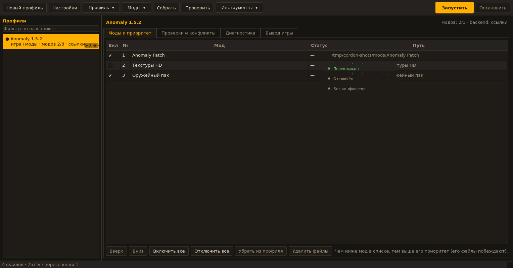

<h1 align="center">CORDON-LINUX</h1>

<p align="center"><strong>Лаунчер профилей и модов S.T.A.L.K.E.R. для Linux с адаптацией под движок OpenXRay</strong></p>

<p align="center">
  
</p>

<p align="center">
  <strong>Несколько сборок S.T.A.L.K.E.R. в одном лаунчере: изолированные моды, сохранения и настройки.</strong>
</p>

<p align="center">
  <a href="#установка"><strong>Установка</strong></a>
  ·
  <a href="docs/USER_GUIDE_LINUX_RU.md">Руководство пользователя</a>
  ·
  <a href="#возможности">Возможности</a>
  ·
  <a href="#english">English</a>
</p>

<p align="center">
  
  
  
  <a href="LICENSE.md"></a>
</p>

---

## Что это

**CORDON-LINUX** — нативный порт лаунчера [CORDON](https://github.com/ITzSYUK/CORDON) (Windows, WPF/.NET 8) на Python + Qt (PySide6).
Идея, формат профилей и порядок модов («чем ниже в списке — тем выше приоритет») сохранены, а Windows-специфичная часть
заменена на нативные механизмы Linux:

| Было в Windows-версии | Стало в Linux |
| --- | --- |
| USVFS (Mod Organizer 2) для виртуального наложения файлов | backend `link` (символические ссылки) или `fuse-overlayfs` |
| NTFS-жёсткие ссылки Workspace | обычные символические ссылки, без копирования игры |
| Реестр Windows, `%APPDATA%` | XDG-каталоги (`~/.config`, `~/.local/share`, `~/.cache`) и JSON |
| Запуск `.exe` | запуск ELF-бинарника `xr_3da` с ключами командной строки **OpenXRay** |
| Антивирусы, UAC, права администратора | не требуются: установка в `~/.local` без root |

Оригинальная Windows-версия остаётся в репозитории (`src/StalkerModLauncher/`) и не изменялась —
её описание: **[README.WINDOWS.md](README.WINDOWS.md)**.

## Возможности

| Раздел | Что есть |
| --- | --- |
| Профили | создание, копирование, переименование, удаление; режимы «игра + моды» и «готовая сборка»; отдельные логи, сохранения, настройки и скриншоты у каждого профиля |
| Моды | добавление папок, поиск модов в каталоге, установка из `zip` / `7z` / `rar` / `tar.*` в управляемое хранилище, включение и отключение, изменение приоритета одиночным и групповым перетаскиванием, удаление вместе с файлами |
| Конфликты | статус каждого мода (перекрывает / перекрыт / смешанный / полностью перекрыт), список пересекающихся файлов, итоговое дерево «кто побеждает», исключение отдельного файла из оверлея без правки самого мода |
| Проверки | предполётная проверка перед запуском, вкладка «Проверки и конфликты», команда `cordon doctor` |
| Linux-специфика | аудит чувствительности к регистру (создаёт ссылки-алиасы), проверка библиотек движка через `ldd`, XDG-каталоги, работа без root |
| Engine | автоматический поиск движка (portable-раскладка, системная установка, Flatpak-подобная), выбор файла вручную, учёт движков из включённых модов |
| MO2 | импорт порядка и включённости модов из `modlist.txt` Mod Organizer 2, подключение папки `overwrite` |
| Прочее | Discord Rich Presence через UNIX-сокет, портативный режим, экспорт и импорт профиля в JSON, отчёты, журнал лаунчера с ротацией, тёмная (PDA) и светлая темы |

## Требования

* **Linux x86_64** с Python **3.10+** (на Arch — системный `python`, сейчас это 3.14: порт использует только
  стандартную библиотеку). Для графического интерфейса — PySide6: пакет дистрибутива (`pyside6` в Arch)
  или копия из PyPI.
* **Нативная сборка движка OpenXRay** (`xray-16`) под Linux — ELF-файл `xr_3da`: из репозитория движка,
  из AUR (Arch), из пакета дистрибутива или из portable-архива. Windows-сборки (`.exe`) не подходят.
* **Данные игры**: `gamedata/` и/или архивы `gamedata.db*` плюс `fsgame.ltx` —
  Зов Припяти 1.6.02, Чистое небо 1.5.10, CoC/Anomaly 1.4.x и производные.
  OpenXRay не поддерживает Тень Чернобыля: для SoC нужна другая сборка движка.

Системные утилиты — по желанию, лаунчер сообщает об их отсутствии в `cordon tools`:

| Утилита | Зачем | Arch | Debian/Ubuntu | Fedora |
| --- | --- | --- | --- | --- |
| `fuse-overlayfs` + `fusermount3` | backend «fuse-overlayfs» | `fuse3 fuse-overlayfs` | `fuse3 fuse-overlayfs` | `fuse3 fuse-overlayfs` |
| `7z` | архивы `.7z` | `7zip` (заменяет устаревший `p7zip`) | `p7zip-full` | `p7zip p7zip-plugins` |
| `unrar` | архивы `.rar` | `unrar` | `unrar` | `unrar` |
| `xdg-open` | открытие каталогов профиля | `xdg-utils` | `xdg-utils` | `xdg-utils` |
| PySide6 | графический интерфейс | `pyside6` | `python3-pyside6.qtwidgets` | `python3-pyside6` |

## Установка

### Arch Linux

```bash
# 1. Зависимости: интерфейс, FUSE-оверлей, распаковка архивов
sudo pacman -S --needed python pyside6 fuse3 fuse-overlayfs 7zip unrar xdg-utils git

# 2. Сам лаунчер (ставится в ~/.local, без root)
git clone https://github.com/defaultdj/CORDON-LINUX.git
cd CORDON-LINUX && ./install.sh

# 3. Движок — по желанию: сборка OpenXRay из AUR
yay -S openxray          # ставит /usr/games/xr_3da и данные в /usr/share/openxray
```

Системный `pyside6` из pacman подхватывается автоматически: `install.sh` создаёт venv с доступом к системным
пакетам и не тянет вторую копию Qt из PyPI (~100 МБ). В меню приложений появится пункт **CORDON-LINUX**.

Сборка pacman-пакета (если хочется пакетный менеджмент вместо `install.sh`):

```bash
sudo pacman -S --needed base-devel python-build python-installer python-wheel python-setuptools
cd packaging/arch && makepkg -si      # соберёт cordon-linux из локальной копии репозитория и поставит его
```

Пакет ставит `/usr/bin/cordon`, `/usr/bin/cordon-gui`, `.desktop`-файл, иконку и документацию в
`/usr/share/doc/cordon-linux`. Пользуйтесь одним способом установки: либо `install.sh`, либо `makepkg`.

### Debian / Ubuntu

```bash
sudo apt install python3-venv python3-pyside6.qtwidgets fuse3 fuse-overlayfs p7zip-full libarchive-tools unrar xdg-utils git
git clone https://github.com/defaultdj/CORDON-LINUX.git
cd CORDON-LINUX && ./install.sh
```

Черновая заготовка пакета: `packaging/debian` (копируется в корень репозитория, затем `dpkg-buildpackage -b -uc`).

### Fedora

```bash
sudo dnf install python3-pyside6 fuse3 fuse-overlayfs p7zip p7zip-plugins unrar xdg-utils git
git clone https://github.com/defaultdj/CORDON-LINUX.git
cd CORDON-LINUX && ./install.sh
```

### Любой дистрибутив (pipx)

```bash
pipx install "cordon-linux[gui] @ git+https://github.com/defaultdj/CORDON-LINUX.git"
```

### Что делает `install.sh`

```bash
./install.sh                    # в ~/.local (рекомендуется)
./install.sh --system           # в /usr/local (через sudo)
./install.sh --prefix ~/opt/cordon
./install.sh --no-gui           # без PySide6, только CLI
./install.sh --portable ~/games/stalker   # плюс portable-лаунчер рядом с данными
PYTHON_BIN=python3.13 ./install.sh        # выбрать конкретный интерпретатор
```

Скрипт создаёт приватное виртуальное окружение в `<prefix>/lib/cordon-linux`, ставит туда пакет,
прописывает `cordon` и `cordon-gui` в `PATH` и добавляет пункт меню. Ничего вне `<prefix>` не изменяется,
пароли и root не нужны.

Проверка установки:

```bash
cordon --version   # CORDON-LINUX 0.1.0
cordon tools       # что найдено в системе: движок, FUSE, 7z, unrar, Discord
```

## Быстрый старт

```bash
cordon tools                                        # что найдено в системе
cordon new "Anomaly 1.5.2" --game ~/games/anomaly   # создать профиль; для готовой сборки — --kind standalone
cordon mod-add "Anomaly 1.5.2" ~/Downloads/Mods     # добавить моды: папки или архивы
cordon mods "Anomaly 1.5.2"                         # список модов и порядок приоритета
cordon prepare "Anomaly 1.5.2"                      # собрать оверлей профиля
cordon launch  "Anomaly 1.5.2" --dry-run            # посмотреть итоговую команду запуска
cordon doctor  "Anomaly 1.5.2"                      # предполётные проверки
cordon launch  "Anomaly 1.5.2"                      # играть
```

То же самое в графическом интерфейсе: запустите **CORDON-LINUX** из меню приложений или `cordon-gui`.
Порядок профиля: **Создать** → указать игру и папки модов → проверить найденный движок и порядок модов →
**Собрать** → **Запустить**. Подробности — в [руководстве пользователя](docs/USER_GUIDE_LINUX_RU.md).

## Интерфейс


Тёмная (PDA) и светлая темы, вкладки «Моды и приоритет», «Проверки и конфликты», «Диагностика» и
«Вывод игры». Исходные скриншоты: [docs/screenshots](docs/screenshots).

## Как подключаются моды

| Backend | Как работает | Плюсы | Минусы |
| --- | --- | --- | --- |
| `link` (по умолчанию) | в каталоге профиля строится дерево символических ссылок на файлы модов | без root и FUSE, работает на ext4/btrfs/xfs/tmpfs, переживает перезагрузку | зависит от поддержки символических ссылок (в S.T.A.L.K.E.R. проблем не вызывает) |
| `fuse-overlayfs` | настоящее наложение слоёв, точки монтирования `gamedata` | максимально «честная» файловая система для движка | нужны `fuse-overlayfs` и `fusermount3`; монтирование живёт только во время сессии |
| `direct` | ничего не собирается: профиль просто указывает движку данные | мгновенно | конфликты разрешает сам движок, порядок приоритетов не гарантирован |

Переключение: «Настройки профиля» → «Способ сборки» либо `cordon edit <профиль> --backend fuse-overlayfs`.

## Адаптация под OpenXRay

* **`-fsltx`** — каталог профиля становится `$fs_root$` движка. `fsgame.ltx` в каталоге игры
  **никогда не изменяется**: рядом с профилем создаётся его копия, где `$app_data_root$` указывает внутрь профиля
  (или в общую папку игры, если выбрано «общие данные»).
* **`-overlaypath`** — логи, сохранения, скриншоты и `shaders_cache` профиля попадают в
  `profiles/profile-<id>/_appdata_`. Каталог создаётся заранее из-за особенностей `CLocatorAPI::_initialize`.
* **Переключатель игры** — `-cs` для Чистого неба (в OpenXRay есть ресурсы CoP/CS/CoC; CoP — режим по умолчанию).
* **Флаги движка** — `-nosplash`, `-no_gamepad`, `-i`, `-dedicated`, `-gl`, `-savescreenshots`,
  `-silent_error_mode`, `-nolog` доступны чекбоксами, дополнительные аргументы вписываются строкой.
  Неизвестные ключи лаунчер подсвечивает в проверках (список взят из `misc/linux/bash-completion` движка).
* **Библиотеки** — если `xr_3da` не запускается из-за отсутствующих `lib*.so`, лаунчер сообщает об этом
  (проверка `ldd`), а portable-сборки получают свой каталог в начало `LD_LIBRARY_PATH`.
* **Регистр путей** — в Linux-версии VFS движка регистр имеет значение (`xr_fs_strlwr` на Linux — заглушка).
  Поэтому есть аудит: лаунчер ищет в `.ltx/.xml/.script/.lua` ссылки, не совпадающие с диском по регистру,
  и по кнопке создаёт ссылки-алиасы (`gamedata/Textures -> textures`). Алиасы хранятся в
  `<профиль>/.cordon-aliases.json` и восстанавливаются после каждой пересборки.
* **Готовые раскладки** — portable (`bin/xr_3da`, `bin_x64/`, `engine/` рядом с данными), системная
  (`/usr/games/xr_3da` + `/usr/share/openxray`) и Flatpak-подобная (`/app/share/openxray`) находятся автоматически.

Что происходит при запуске:

```
profiles/profile-<id>/            $fs_root$ для движка
├── fsgame.ltx                    подготовленная копия (исходный fsgame.ltx не изменяется)
├── gamedata/                     объединённое дерево: данные движка → игра → моды (последний побеждает)
├── db/mods/                      модовые архивы *.db, подключённые модами
├── patches/, bin/, ...           корневые ссылки на файлы игры и движка
└── _appdata_/                    логи, сохранения, скриншоты, shaders_cache этого профиля
```

```bash
/usr/games/xr_3da -fsltx ~/.local/share/cordon/profiles/profile-<id>/fsgame.ltx \
                  -overlaypath ~/.local/share/cordon/profiles/profile-<id>/_appdata_ \
                  -cs
```

## Каталоги и настройки

| Что | Путь по умолчанию | Переопределение |
| --- | --- | --- |
| Настройки | `~/.config/cordon/settings.json` | `--config-dir`, `CORDON_CONFIG_DIR` |
| Профили и моды | `~/.local/share/cordon/` | `--data-dir`, `CORDON_DATA_DIR` |
| Кэш | `~/.cache/cordon/` | `--cache-dir`, `CORDON_CACHE_DIR` |
| Журнал лаунчера | `~/.cache/cordon/launcher.log` (1 МиБ + 1 архив) | — |
| Всё в одном каталоге | `cordon --portable /path/to/dir` | создаёт `config/`, `data/`, `cache/` рядом |

Настройки пишутся атомарно и под блокировкой (`flock`); повреждённый файл сохраняется в
`recovery/<имя>.<метка>.json`, есть резервная копия `settings.backup.json`.
Исходные папки игры и модов используются только для чтения — лаунчер пишет лишь в свои каталоги.

## Команды CLI

| Команда | Назначение |
| --- | --- |
| `cordon list` / `new` / `show` / `edit` / `duplicate` / `delete` | профили |
| `cordon mods` / `mod-add` / `mod-scan` / `mod-install` / `mod-state` / `mod-move` / `mod-remove` | моды |
| `cordon prepare` | собрать оверлей профиля (`--force` — пересобрать) |
| `cordon launch [--dry-run] [--detach] [--skip-check] [--presence]` | запуск игры |
| `cordon doctor [--json]` | предполётные проверки |
| `cordon conflicts [--tree]` | конфликты модов и итоговое дерево |
| `cordon audit [--fix]` | аудит регистра путей |
| `cordon fsgame` | показать подготовленный `fsgame.ltx` |
| `cordon import-mo2 <профиль> <путь> [--apply]` | импорт из Mod Organizer 2 |
| `cordon export` / `import` | обмен профилями (JSON) |
| `cordon report`, `open`, `unmount`, `tools`, `gui` | сервисные команды |

Общие ключи: `--config-dir`, `--data-dir`, `--cache-dir`, `--portable <каталог>`, `--json`, `-v`, `--version`.

## Диагностика

| Симптом | Что делать |
| --- | --- |
| «Исполняемый файл движка не найден» | укажите каталог движка в настройках профиля или задайте полный путь (например `/usr/games/xr_3da`) |
| «Не хватает библиотеки движка» | доустановите зависимости движка: `ldd /usr/games/xr_3da` покажет список отсутствующих `lib*.so` |
| `Exec format error` | файл движка не ELF (это Windows-сборка) либо не отмечен как исполняемый: `chmod +x xr_3da` |
| Пустой экран или краш на старте, в логе «cannot find texture» | `cordon audit "<профиль>" --fix` (регистр путей), затем посмотрите `_appdata_/logs/xray_*.log` |
| Оверлей не монтируется | установите `fuse3` и `fuse-overlayfs` (проверьте, что `/dev/fuse` доступен), либо переключитесь на backend `link` |
| Игра не видит сохранения | проверьте «Данные игры» в настройках профиля: «Внутри профиля» (по умолчанию) или «Общая папка игры» |
| Мод «полностью перекрыт» | его файлы целиком замещаются модами ниже по списку — мод можно выключить |
| Discord-статус не появляется | Presence выключен по умолчанию: включите его в настройках, клиент Discord должен быть запущен в той же сессии |
| Нужно вернуть чистую игру | `cordon delete "<профиль>"` удаляет только каталог профиля и распакованные моды; исходные папки модов остаются на месте |

## Разработка

```bash
python3 -m venv .venv && .venv/bin/pip install -e ".[gui,dev]"
.venv/bin/python -m pytest tests/cordon -q   # 155 тестов: ядро, CLI, GUI, интеграция с реальным процессом
.venv/bin/ruff check src tests               # линтер
```

```
src/cordon/
├── core/      # логика без GUI: пути, ELF, fsgame, слои, оверлей, моды, конфликты, проверки,
│              # аудит регистра, запуск, настройки, сервисный слой, Discord
├── gui/       # PySide6: главное окно, таблица модов, диалоги, темы, фоновые задачи
└── cli.py     # консольный интерфейс (cordon)
tests/cordon/  # pytest: мини-установка игры, движка и модов в tmp_path
```

Ядро не импортирует PySide6: CLI, GUI и тесты используют один сервисный слой
(`cordon.core.service.CordonService`). Интеграционные тесты запускают `/usr/bin/true` в роли движка,
поэтому реально проверяются сборка оверлея, `Popen`, захват вывода и коды возврата.
GUI-тесты запускаются без экрана (`QT_QPA_PLATFORM=offscreen`) и пропускаются, если PySide6 не установлен.

Документация: [техническое описание порта (EN)](docs/TECHNICAL_LINUX_EN.md),
[руководство пользователя (RU)](docs/USER_GUIDE_LINUX_RU.md),
[импорт из Mod Organizer 2](docs/MO2_IMPORT_GUIDE_RU.md),
[документация оригинального Windows-лаунчера](docs/TECHNICAL_EN.md).

## Лицензия

Код распространяется по [GNU GPLv3](LICENSE.md), как и оригинальный CORDON.
Сторонние компоненты и ресурсы сохраняют свои лицензии: [THIRD_PARTY_NOTICES.md](THIRD_PARTY_NOTICES.md).
Оригинальный лаунчер: <https://github.com/ITzSYUK/CORDON>. Движок: <https://github.com/OpenXRay/xray-16>.

Это неофициальный фанатский инструмент, не связанный с GSC Game World и не одобренный компанией.
S.T.A.L.K.E.R. и связанные товарные знаки принадлежат их правообладателям.

---

<a id="english"></a>

## English

**CORDON-LINUX — a native Linux port of the CORDON S.T.A.L.K.E.R. mod launcher, tuned for the
[OpenXRay](https://github.com/OpenXRay/xray-16) engine.**

It is a Python + PySide6 rewrite of the original Windows launcher (WPF/.NET 8). Profiles, mod ordering
("lower in the list wins") and the conflict analyzer are unchanged, while the Windows-only parts are
replaced with native Linux mechanisms: symlink trees or `fuse-overlayfs` instead of USVFS and NTFS hard
links, XDG directories and JSON instead of the registry, and OpenXRay command-line keys instead of
launching an `.exe`. The original Windows application is untouched in `src/StalkerModLauncher/` and
documented in [README.WINDOWS.md](README.WINDOWS.md).

### Install

Arch Linux:

```bash
sudo pacman -S --needed python pyside6 fuse3 fuse-overlayfs 7zip unrar xdg-utils git
git clone https://github.com/defaultdj/CORDON-LINUX.git
cd CORDON-LINUX && ./install.sh        # installs into ~/.local, no root required
yay -S openxray                        # optional: native OpenXRay build from AUR
```

A pacman package can be built from the checkout as well: `cd packaging/arch && makepkg -si`.

Debian/Ubuntu: `python3-venv python3-pyside6.qtwidgets fuse3 fuse-overlayfs p7zip-full libarchive-tools unrar`,
Fedora: `python3-pyside6 fuse3 fuse-overlayfs p7zip p7zip-plugins unrar` — then run `./install.sh`.
Any distribution: `pipx install "cordon-linux[gui] @ git+https://github.com/defaultdj/CORDON-LINUX.git"`.

### Quick start

```bash
cordon tools                                    # what was found in the system
cordon new "Anomaly 1.5.2" --game ~/games/anomaly
cordon mod-add "Anomaly 1.5.2" ~/Downloads/Mods
cordon prepare "Anomaly 1.5.2"
cordon launch  "Anomaly 1.5.2"
```

Or start CORDON-LINUX from the application menu (`cordon-gui`).

### Features

- Profiles for "game + mods" and ready-to-play standalone builds, with per-profile saves, settings, logs and screenshots.
- Mod installation from folders, `zip`, `7z`, `rar` and `tar.*`, drag-and-drop priority order, enable/disable and removal.
- Conflict analysis: which mod wins, which files are overridden, the resulting file tree, per-file exclusions.
- Pre-flight checks (`cordon doctor`), case-sensitivity audit with automatic alias links, `ldd` check of engine libraries.
- Mod Organizer 2 `modlist.txt` import.
- Engine keys of OpenXRay: `-fsltx`, `-overlaypath`, `-cs`, `-nosplash`, `-no_gamepad`, `-gl` and more.
- No root, no FUSE requirement, no game copy: everything lives in `~/.config`, `~/.local/share`, `~/.cache`.

### Mod mounting backends

| Backend | How it works | Trade-off |
| --- | --- | --- |
| `link` (default) | symlink tree inside the profile | works everywhere, survives reboots, required no root |
| `fuse-overlayfs` | real layer overlay, `gamedata` mount points | needs `fuse-overlayfs` + `fusermount3`, session-bound |
| `direct` | nothing is built, the engine reads the folders | fastest, but mod priority is not enforced |

### Requirements

Linux x86_64 with Python 3.10+, PySide6 for the GUI, game data (`gamedata/` or `gamedata.db*` + `fsgame.ltx`)
of Call of Pripyat 1.6.02, Clear Sky 1.5.10 or CoC/Anomaly 1.4.x, and a **native OpenXRay build**
(ELF `xr_3da`). Windows `.exe` engines are not supported, and OpenXRay has no Shadow of Chernobyl assets.

### Documentation

[User guide (RU)](docs/USER_GUIDE_LINUX_RU.md) · [Port internals (EN)](docs/TECHNICAL_LINUX_EN.md) ·
[Mod Organizer 2 import (RU)](docs/MO2_IMPORT_GUIDE_RU.md) · [Original Windows docs](docs/TECHNICAL_EN.md)

## License

The launcher source code is licensed under the [GNU GPLv3](LICENSE.md). Third-party components and assets
retain their original licenses; see [THIRD_PARTY_NOTICES.md](THIRD_PARTY_NOTICES.md).

This is an unofficial fan-made tool and is not affiliated with or endorsed by GSC Game World.
S.T.A.L.K.E.R. and related trademarks belong to their respective owners.
